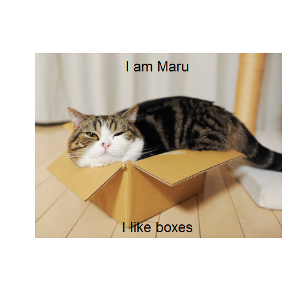
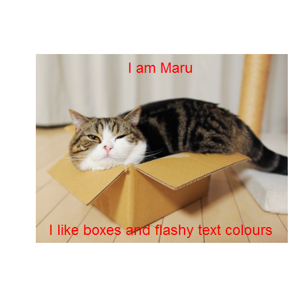
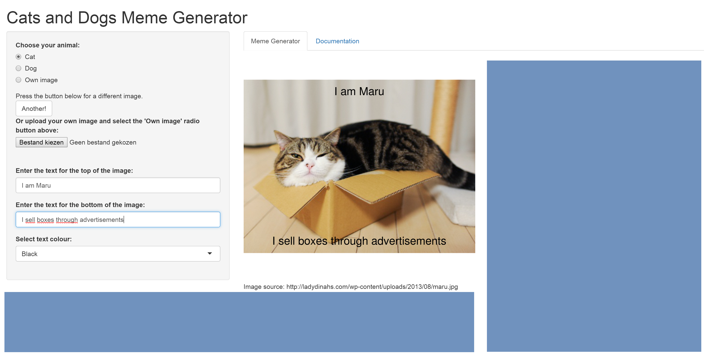

<style>
aside.gdbar img {
  width: 154px; 
  height: 24px; 
  right: 0;
  left: 8px;
  top: 22px;
  margin: 15px 15px;
}
  .title-slide {
     background-color: #9db2ca; 
   }
  .title-slide hgroup > h1{
     color: #2b3d50 ;
}
  .title-slide hgroup > h1, 
  .title-slide hgroup > h2 {
     color: #2b3d50 ;
}
  slide:not(.segue) h2{color: #2b3d50}
</style>
<!-- Limit image width and height -->
<style type='text/css'>
img {
    max-height: 400px;
    max-width: 800px;
}
</style>

<!-- Center image on slide -->
<script src="http://ajax.aspnetcdn.com/ajax/jQuery/jquery-1.7.min.js"></script>
<script type='text/javascript'>
$(function() {
    $("p:has(img)").addClass('centered');
});
</script>
<style>
em {
  font-style: italic
}
</style>

## The Meme Generator: What IS it?

* Generate funny images with top- and/or bottom text captions!
* Included are:
     * 6 predefined images, 3 cats, 3 dogs
     * Possibility of uploading your own images
     * Customizable captions
     * Customizable text colours for text visibility
     
## How does it work?
* Reads in .JPG files and displays them as graphs using base R plotting system
* Base plotting system allows adding text using *text()* function
* The key function behind the system, *plot_jpeg()* is based on [this source](http://stackoverflow.com/questions/9543343/plot-a-jpg-image-using-base-graphics-in-r)

--- .class #id 

## How it works: Example usage of *plot_jpeg*


```r
# Example usage:
plot_jpeg("cat2.jpg", "I am Maru", "I like boxes", "black")
plot_jpeg("cat2.jpg", "I am Maru", "I like boxes and flashy text colours", "red")
```

  

---

## What else is out there?

* Many meme generators exist, eg. [here](https://imgflip.com/memegenerator)
* Ours is better, because it is:
     * Written with R and Shiny!
     * Easy to use
     * For cat lovers: comes with cat pictures
     * For dog lovers: comes with dog pictures
     * Other lovers: you can bring your own pictures

---

## How to make money?

* Short answer: advertisements
     * [Google AdSense](https://www.google.com/adsense/start/#?modal_active=none)
     * Lots of room to place ads without overloading page, see blue areas:
     

     


